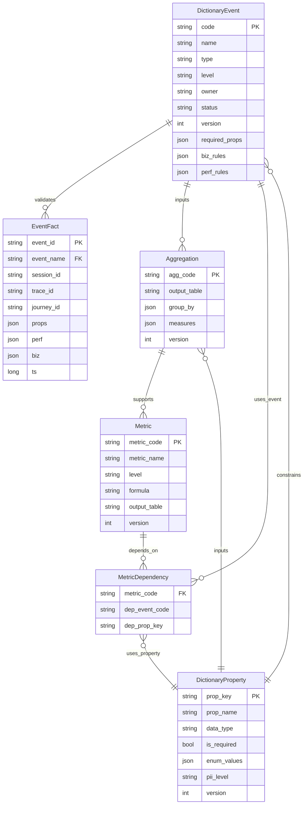

# Vemetric 逻辑数据模型（Logical Data Model）与指标血缘（MVP）

目标：解决你指出的两个核心问题
- **实体仅靠命名关联，缺少形式化约束**：我们在 MongoDB 里无法用外键强约束，但可以用“逻辑外键 + 校验规则 + 版本快照”实现同等效果。
- **L1-L5 跨层计算不透明**：用“指标依赖矩阵”把每个指标依赖哪些事件、哪些字段、哪些规则完全展开，实现变更影响分析（数据血缘）。

---

## 一、实体与关系（ER / Logical）

### 1) 核心实体（MVP）
- **DictionaryProperty**：属性字典（字段定义与口径）
- **DictionaryEvent**：事件字典（事件语义与规则）
- **Aggregation**：聚合/计算单元（把 raw_events 变成统计宽表）
- **Metric**：指标定义（指标口径、依赖、展示）
- **EventFact**：事实事件（raw_events 中的一条上报数据）

### 2) 逻辑外键（Logical FK）的定义
> “逻辑外键”= 一个稳定的 id + 校验约束 + 版本快照。即使底层是 Mongo，也能保证关联可靠。

- `EventFact.event.name` **必须**存在于 `DictionaryEvent.code`
- `EventFact.event.props.*` / `EventFact.biz.*` / `EventFact.perf.*` 的字段名与类型 **必须**符合 `DictionaryEvent.required_props` 与 `DictionaryProperty`
- `Metric` 通过 `depends_on` 显式依赖 `Aggregation`；`Aggregation` 显式依赖 `DictionaryEvent` 与 `DictionaryProperty`

### 3) ER（Mermaid）



---

## 二、MVP 的“形式化约束”怎么落地（不靠数据库外键）

### 1) 校验层（Collector / Aggregator）
在 Collector 与聚合脚本里实现 3 类校验：
- **事件存在性**：`event.name` 必须在 `DictionaryEvent` 中（否则 unknown）
- **字段存在性**：required 字段缺失 → 标记 `invalid_required_missing`
- **字段类型/枚举**：类型不符、枚举非法 → 标记 `invalid_type` / `invalid_enum`

> 这就是“逻辑外键”的 enforcement：不让“自由发挥的数据”污染宽表与指标。

### 2) 版本快照（Version Snapshot）
- `DictionaryEvent.version` / `DictionaryProperty.version` 发布成快照（不可变）
- `Aggregation.version` / `Metric.version` 必须引用“字典快照版本”

效果：当你改字段或阈值，系统能知道“影响的是 v12 的指标”，并且可以回滚。

---

## 三、指标依赖矩阵（MVP 示例）

> 你要的“指标依赖矩阵表”= 变更影响分析的基础。  
> 下面给出 MVP 必须覆盖的一组指标（来自 `context/指标.md`），并把依赖展开到事件与字段。

| 指标（metric_code） | 层级 | 口径（formula 简述） | 依赖事件（event.type / event.name） | 依赖字段（Logical FK） | 变更敏感点 |
| :--- | :--- | :--- | :--- | :--- | :--- |
| `active_users` | L1 | distinct(user_id or anonymous_id) | `page_view` | `user.user_id` / `user.anonymous_id` | 用户标识策略 |
| `feature_uv` | L1 | distinct(user) where event.name=feature | 任意（业务事件） | `event.name` | 事件重命名 |
| `path_start_count` | L2 | distinct(trace_id) where step=start | `path_step(start)` | `session.trace_id`, `session.path_id`, `session.step_id` | trace 生成时机 |
| `path_completion_rate` | L2 | completed / started | `path_step(end)` + `path_step(start)` | 同上 | end 定义变化 |
| `drop_off_step` | L2 | max drop step | `path_step(*)` | `session.step_id` | 步骤拆分/合并 |
| `page_stay_avg` | L3 | avg(page_leave.duration_ms) | `page_leave` | `event.page.duration_ms` | 离开事件丢失 |
| `op_interval_p50` | L3 | p50(event.ts - prev_event_ts) | 任意交互事件 | `session.prev_event_ts`, `event.ts` | prev_event_ts 写入逻辑 |
| `rage_click_rate` | L3 | repeat_click/session | `ui_click` | `event.element.rage_click`, `session.session_id` | rage 阈值规则 |
| `exposure_ctr` | L3 | click/expose by exposure_id | `ui_exposure` + `ui_click` | `event.element.exposure_id` | 曝光采集范围 |
| `api_duration_p95` | L4 | p95(perf.api.duration_ms) | `api_perf` | `perf.api.duration_ms` | 采样率/脱敏 |
| `api_slow_rate` | L4 | count(is_slow)/total | `api_perf` | `perf.api.is_slow` | slow 阈值 |
| `error_rate` | L4 | error/total | `js_error` + `api_perf` | `perf.error.*`, `perf.api.status_code` | 错误归类口径 |
| `biz_loss_count` | L5 | slow/error × biz_id (no success in window) | `api_perf/js_error` + `biz_outcome` | `biz.biz_id`, `DictionaryEvent.biz_rules` | loss window / success events |
| `biz_loss_amount` | L5 | sum(biz.amount) over losses | 同上 | `biz.amount` | 金额字段映射 |

---

## 四、如何“自动生成”依赖矩阵（MVP 实现路径）

### 1) 增加一个 `metric_dictionary`（MVP 就够）
每个指标存：
- `metric_code/name/level`
- `formula`（人读的描述或 DSL）
- `depends_on`（结构化依赖列表：事件、字段、规则）
- `output_table`（最终从哪个聚合表取数）

### 2) 生成血缘图与影响分析
当发生变更（例如字典事件改了 required_props 或 perf_rules）：
- 扫描 `metric_dictionary.depends_on`，找出引用该事件/字段/规则的指标集合
- 输出“受影响指标列表 + 影响原因”（例如：`api_slow_rate` 的 `slow_threshold_ms` 变了）

> MVP 阶段：先用一个脚本把 `metric_dictionary` 导出成 markdown 依赖矩阵即可；后续再做 UI。

---

## 五、对你们 MVP 的建议（最小但不粗糙）
- **不强求数据库外键**：Mongo 场景下“逻辑外键 + 校验 + 版本快照”就够用。
- **先把矩阵做出来**：哪怕第一版是静态 markdown，它也能让团队变更时不再“拍脑袋”。
- **把 L5 规则写进字典**：否则 `slow/error × biz_id` 会永远停留在 PPT 上。

---

## 六、埋点数据协议层（Tracking Schema Layer / Schema Registry）（MVP 形态）

你提出的链路是正确方向：

SDK → **Schema Registry** → Collector → Aggregator → Metric Store

MVP 不做“平台化 Schema Registry”，但要做“轻量版协议层”，目的只有一个：**消灭 Collector ↔ Aggregator 的语义漂移**（字段改了、聚合逻辑还按旧字段跑）。

### 6.1 职责边界（把生命周期拆开，避免混在一起）
为了解决你提的“事件、指标、规范、字段字典混在同一套生命周期中”的问题，建议按层划分：

- **Tracking Schema Layer（协议层）**：只管“事件长什么样”（字段结构/类型/必填/枚举/版本）
- **Event Dictionary（语义层）**：只管“事件是什么意思”（L1-L5、owner、口径说明、slow 阈值、loss window、success events）
- **Metric Dictionary（指标层）**：只管“指标怎么算”（depends_on、公式、输出表）
- **Aggregator（计算层）**：只管“按版本把事实表变宽表/指标表”（不写死字段名，按 schema_version 取映射）

> 协议层 = 数据契约；语义层 = 业务含义；指标层 = 计算依赖。三者版本可以联动，但不必同生命周期强绑定。

### 6.2 MVP 的 Schema Registry 需要包含什么（最小集合）
MVP 推荐用 **JSON Schema + Git 版本化**（也可以存 Mongo `schema_registry` 集合，但依旧要版本不可变）：

- `schema_version`：整数递增（发布一次 +1）
- `envelope_schema`：Event Envelope 的整体结构约束（context/session/user/event/perf/biz）
- `event_schema_refs`：事件级 schema（可选）。MVP 可以只做 envelope + 基础类型校验；关键事件再细化。
- `compatibility`：兼容策略（MVP 先支持 `BACKWARD`：新增字段不破坏旧消费者；删除/重命名必须发新版本并迁移）

### 6.3 Schema Registry 的推荐数据结构（示例）
下面是一个可以直接落库/落文件的 `schema_registry` 记录示例（MVP）：

```json
{
  "schema_version": 1,
  "status": "active",
  "created_at": "2026-01-13T00:00:00Z",
  "created_by": "data_owner",
  "compatibility": "BACKWARD",
  "envelope_schema": {
    "$schema": "https://json-schema.org/draft/2020-12/schema",
    "type": "object",
    "required": ["context", "session", "user", "event"],
    "properties": {
      "context": { "type": "object" },
      "session": { "type": "object" },
      "user": { "type": "object" },
      "event": {
        "type": "object",
        "required": ["type", "name", "ts", "level", "sdk"],
        "properties": {
          "type": { "type": "string" },
          "name": { "type": "string" },
          "ts": { "type": "number" },
          "level": { "type": "string", "enum": ["L1", "L2", "L3", "L4", "L5"] },
          "props": { "type": "object" },
          "sdk": { "type": "object" }
        }
      },
      "perf": { "type": "object" },
      "biz": { "type": "object" }
    },
    "additionalProperties": true
  },
  "event_schema_refs": {
    "api_perf": {
      "required": ["perf.api.method", "perf.api.url", "perf.api.duration_ms", "perf.api.status_code", "perf.api.is_slow"]
    },
    "biz_outcome": {
      "required": ["biz.biz_id", "biz.outcome"]
    }
  }
}
```

说明：
- MVP 先不追求“完美 JSON Schema 递归定义”，重点是：**必填字段/核心类型能挡住漂移**。
- `event_schema_refs` 先用于“关键事件”的额外约束（例如 `api_perf`、`biz_outcome`），避免 L4/L5 口径被破坏。

### 6.4 各环节怎么用 Schema（避免漂移的关键动作）

#### SDK（生成事件时自动校验）
- SDK 在构建事件 envelope 时读取当前 `schema_version`（配置或动态下发）
- **开发/测试环境**：严格校验（不通过直接 warn/拒发）
- **生产环境**：轻校验（不通过降级/采样/修正），避免影响业务

#### Collector（强校验 + 打标）
- Collector 以 `schema_version` 为入口校验 envelope：
  - 必填字段缺失：`invalid_required_missing`
  - 类型/枚举不符：`invalid_type` / `invalid_enum`
- 无论是否 strict，落库都必须写入 `schema_version`（后续聚合可按版本分支处理）

#### Aggregator（按版本执行聚合/迁移）
- 聚合脚本以 `schema_version` 作为选择器：
  - v1 使用字段 A
  - v2 字段重命名为 B → v2 聚合逻辑改为读 B
- 当发生“破坏性变更”（字段删除/重命名/语义改变）：
  - 发布新 schema_version
  - 追加迁移（可选）：把历史 raw_events 映射成新字段（或在聚合时做兼容读取）

### 6.5 MVP 是否要上 Avro/Protobuf？
结论：**先不做**。
- 你们当前目标是“稳定口径 + 可追溯 + 可迭代”，JSON Schema 足够挡住 80% 漂移问题。
- 当出现多语言接入、吞吐/带宽瓶颈、或需要强 schema 演进工具链时，再升级 Avro/Protobuf。
